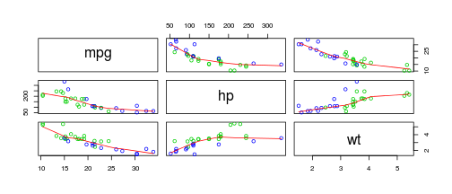

## Challenge

--- .class #id 

## Details

--- .class #id

## Dataset Motorcars
- embedded R code that gets run when slidifying the document

Let us create a simple scatterplot.


```r
require(ggplot2)
qplot(wt, mpg, data = mtcars)
```



--- .class #id

##  Linear Modell

--- .class #id

## Summary

1. Some form of input (widget: textbox, radio button, checkbox, ...)
2. Some operation on the ui input in sever.R
3. Some reactive output displayed as a result of server calculations
4. documentation on the shiny site

- Shiny App: https://code.google.com/p/io-2012-slides/
- ui.R: https://code.google.com/p/io-2012-slides/
- Server.R: https://code.google.com/p/io-2012-slides/
- These Slides: https://code.google.com/p/html5slides/

Note: These slides are done with Slidify. 
Slidify was created by [Ramnath Vaidyanathan](https://github.com/ramnathv) in order to streamline the process of creating and publishing `R` driven presentations.


